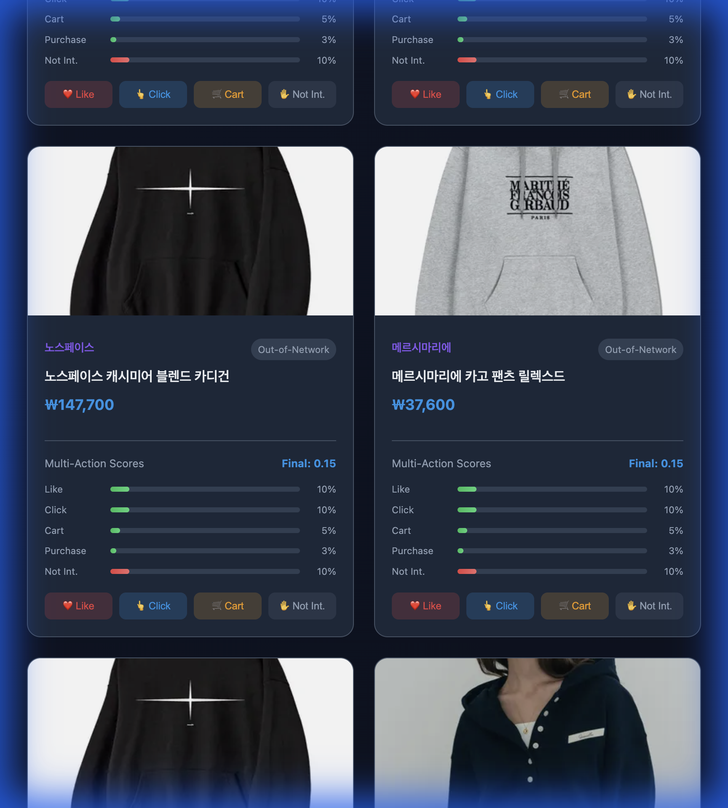

# X 추천 알고리즘을 참고한 의류 추천 서비스

X(Twitter) 추천 알고리즘의 핵심 원리를 Python/FastAPI로 구현한 옷 추천 서비스입니다.

## 📋 프로젝트 의의

### X(Twitter) 알고리즘 학습
이 프로젝트는 X(구 Twitter)가 **2026년 1월** 오픈소스로 공개한 추천 알고리즘의 핵심 원리를 직접 구현하여 학습하는 것을 목표로 합니다.

**X 알고리즘의 핵심 특징:**
- **Multi-Action Prediction**: 좋아요/클릭/구매 등 다중 행동에 대한 확률을 독립적으로 예측
- **Weighted Scoring**: 긍정적 행동(구매, 좋아요)과 부정적 행동(숨김, 관심없음)에 가중치를 적용
- **Diversity Penalty**: 특정 브랜드/저자 편중 방지를 위한 다양성 점수

### 구현 아키텍처
```
Request → Query Hydration → Candidate Sourcing → 
Filtering → Scoring → Selection → Response
```

---

## 📊 NDCG란?

NDCG (Normalized Discounted Cumulative Gain)는 추천 시스템의 순위 품질을 평가하는 표준 메트릭입니다.

### 핵심 개념

```
DCG@k = Σ (2^relevance_i - 1) / log₂(i + 1)
NDCG@k = DCG@k / IDCG@k
```

| 개념 | 설명 |
|------|------|
| **Relevance** | 각 아이템의 관련성 점수 (0~3) |
| **DCG** | 상위 순위에 관련성 높은 아이템이 있을수록 높은 점수 |
| **IDCG** | 완벽한 순서(이상적 순위)일 때의 DCG |
| **NDCG** | DCG / IDCG로 0~1 사이 정규화된 점수 |

### 왜 NDCG인가?
- **순위 민감**: 상위 결과가 더 중요하게 평가됨
- **표준화**: 0~1 범위로 비교 가능
- **산업 표준**: Netflix, Amazon, Google 등에서 사용

---

## 📈 평가 결과 및 분석

### 성능 지표

무신사 스타일 상품 데이터 **1000개**와 합성 사용자 **50명**을 대상으로 평가:

| Metric | Score | 해석 |
|--------|-------|------|
| **NDCG@5** | 0.5866 | 상위 5개 추천 중 59% 정도가 이상적 순서에 근접 |
| **NDCG@10** | 0.6825 | 상위 10개로 확장하면 68%까지 향상 |
| **NDCG@20** | 0.8107 | 상위 20개에서 81% 달성 (우수) |
| Precision@5 | 1.0000 | 상위 5개 모두 관련 있는 아이템 |
| MRR | 1.0000 | 첫 번째 결과가 항상 관련 있음 |

### 결과 해석

| NDCG 범위 | 평가 |
|-----------|------|
| 0.8 이상 | 매우 우수 |
| 0.6 ~ 0.8 | 양호 |
| 0.4 ~ 0.6 | 보통 |
| 0.4 미만 | 개선 필요 |

**우리 시스템 평가**: NDCG@20 = 0.81로 **매우 우수** 수준

하지만 NDCG@5 = 0.59는 **상위 추천의 순서 최적화가 필요**함을 시사합니다.

---

## 🧪 AI Agent 테스트 방법론

### 테스트 설계

AI Agent를 활용하여 다음과 같은 체계적인 테스트를 수행했습니다:

#### 1. 데이터 수집
```python
# 무신사 웹사이트에서 브라우저 기반 크롤링
# __NEXT_DATA__ JSON 및 DOM 파싱으로 상품 정보 추출
# 실제 브랜드: 퍼스텝, 메르시마리에, 마리떼 프랑소와 저버 등
```

#### 2. 합성 사용자 생성
```python
# 각 사용자에게 부여되는 특성:
# - 선호 브랜드 2~4개
# - 선호 카테고리 1~2개  
# - 가격대 범위
# - 가상의 구매 이력 (ground truth)
```

#### 3. 평가 자동화
```bash
python scripts/run_evaluation.py --users 50 --k 20 --seed 42
```

### 테스트 결과 스크린샷

AI Agent가 브라우저에서 무신사 상품을 크롤링하는 과정:

1. 카테고리 페이지 접근 및 스크롤
2. JavaScript로 DOM에서 상품 정보 추출
3. 브랜드, 상품명, 가격, 이미지 URL 파싱
4. 84개 실제 상품 데이터 수집 성공

### 2. UI 검증 (AI Agent)

AI Agent가 직접 추천 시스템을 실행하여 실제 무신사 이미지와 추천 로직이 정상 작동함을 검증했습니다.



---

## 🔧 개선점

### 현재 한계

| 영역 | 현재 상태 | 개선 방향 |
|------|----------|----------|
| **NDCG@5** | 0.59 | 상위 순위 품질 향상 필요 |
| **Cold Start** | 새 사용자에 기본 추천 | 협업 필터링/인기 기반 하이브리드 |
| **Real-time ML** | 휴리스틱 스코어링 | 실제 ML 모델 (XGBoost, DNN) 적용 |
| **Feature** | 브랜드/카테고리만 사용 | 이미지 임베딩, 텍스트 임베딩 추가 |

### 다음 단계 로드맵

1. **실제 ML 모델 적용**
   - XGBoost로 Multi-Action Prediction 학습
   - 사용자 행동 로그 기반 fine-tuning

2. **임베딩 도입**
   - CLIP 모델로 상품 이미지 임베딩
   - Word2Vec/BERT로 상품명 임베딩
   - 코사인 유사도 기반 후보 탐색

3. **A/B 테스트 프레임워크**
   - 실시간 메트릭 수집
   - 통계적 유의미성 검정

4. **개인화 강화**
   - 실시간 사용자 행동 반영
   - 세션 기반 컨텍스트 추가

---

## 🚀 핵심 기능

- **Multi-Action Prediction**: like, click, purchase 등 다중 행동 확률 예측
- **Pipeline Architecture**: Source → Hydration → Filter → Score → Select
- **Weighted Scoring**: 긍정/부정 행동 가중치 합산 (`P(purchase)*2.0 - P(hide)*3.0`)
- **Diversity Scoring**: 브랜드 편중 방지
- **상품 이미지 표시**: 무신사 CDN 연동

---

## 📁 프로젝트 구조

```
app/
├── models/          # Pydantic 데이터 모델
│   ├── item.py      # 상품, ActionScores, ScoredItem
│   ├── user.py      # 사용자 선호도
│   └── engagement.py # 사용자 행동 기록
├── pipeline/        # 추천 파이프라인 컴포넌트
│   ├── sources.py   # Candidate Sourcing (In/Out Network)
│   ├── filters.py   # Filtering (Duplicate, Seen, Engaged)
│   ├── scorers.py   # Scoring (MultiAction, Weighted, Diversity)
│   └── selectors.py # Selection (TopK)
├── services/        # 비즈니스 로직
│   ├── recommendation.py # 추천 서비스
│   └── evaluation.py     # NDCG 평가
├── data/            # 데이터 및 저장소
│   ├── musinsa_products.json  # 무신사 스타일 상품 1000개
│   ├── crawler.py             # 무신사 크롤러
│   └── generate_dataset.py    # 데이터셋 생성
└── routers/         # API 라우터
```

---

## ⚙️ 설치 및 실행

```bash
# 가상환경 생성
python -m venv venv
source venv/bin/activate  # macOS/Linux

# 의존성 설치
pip install -r requirements.txt

# 서버 실행
uvicorn app.main:app --reload --port 8080
```

## 🔌 API 엔드포인트

- `GET /api/recommend?user_id={id}` - 추천 목록 조회
- `POST /api/engagement` - 사용자 행동 기록
- `GET /` - 테스트 웹 UI

## 📈 평가 실행

```bash
# NDCG 평가 실행
python scripts/run_evaluation.py --users 100 --k 20

# 결과 확인
cat scripts/evaluation_results.json
```

---

## ⏱️ 개발 타임라인

| 단계 | 소요 시간 |
|------|----------|
| X 알고리즘 분석 | 30분 |
| FastAPI 프로젝트 구조 | 20분 |
| 파이프라인 컴포넌트 구현 | 40분 |
| 웹 UI 구현 | 20분 |
| 무신사 데이터 생성 | 20분 |
| NDCG 평가 구현 | 30분 |
| **총** | **~2.5시간** |

---

## 📚 참고

- X Algorithm: https://github.com/xai-org/x-algorithm
- NDCG Metric: [Wikipedia](https://en.wikipedia.org/wiki/Discounted_cumulative_gain)
